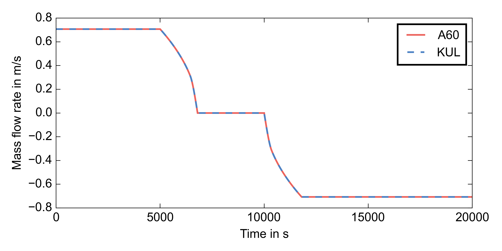

-------------------
Annex60 Pipe models 
-------------------

.. Fixme: Math notation

Introduction
============

This file contains information about the aim of the ``Annex60.Experimental.Pipe`` subpackage and an overview of the development history of the plug flow pipe models. The ``Pipe`` package is developed within the IEA EBC Annex 60. [#f1]_

Aim
===
The ``Pipe`` package is intended as an improvement of the Modelica Standard Library pipes for the specific case of thermal network (district heating and cooling) simulations. The pipe model aims at improving the representation of the delay effects in longer pipes and at accelerating the simulation of such pipes.

Problems that were previously encountered with the existing pipe models include the inability to represent the delay of temperature changes at the inlet of the pipe and the corresponding heat losses.
The current MSL implementation uses one or more mixing volumes (more in case of discretization). This way of modelling is not able to represent the plug flow behaviour, which requires a time delay depending on the fluid velocity and the length of the pipe. The mixing volume approach shows an exponential transition between temperatures instead, whereas the discretized approach causes numerical diffusion effects in the outlet temperature.

After simplification, the equation that has to be solved comes down to the following advection (without diffusion) equation with a sink term (namely the heat losses :math:`\dot{Q}_e`):

.. math::

	\frac{\partial\left(\rho h A\right)}{\partial t} + \frac{\partial\left(\rho vAh\\right)}{\partial x}  = - \dot{Q}_e

In Modelica, the `spatialDistribution` operator allows for solving the left hand side of this equation. To account for the heat loss, the enthalpy (or, for an assumingly incompressible fluid, the temperature) is changed when the fluid exits the pipe. The change in enthalpy or temperature is generally a function of the inlet temperature, the boundary conditions (i.e. mainly the surroundings and possibly other pipes that run in the same direction) and the delay. 

The next section elaborates on the initial contributions to the pipe model and the subsequent developments.

Development history
===================

The development of the ``Pipe`` models was started simultaneously by different participants of Annex 60.

First implementations
---------------------

.. FIXME: please tell me if more precise reference to the actual contributors is needed. I thought the institution would be okay.

The first version in the Annex 60 library, developed at *RWTH Aachen* comprised an adiabatic pipe that implemented the advection equation (the plug flow delay), later extended with heat loss operators at both sides of the pipe. The heat operators implement an exponential temperature decay for a single pipe and known heat transfer coefficient to the surrounding (with ambient temperature as the boundary condition). The instantaneous outlet velocity is used as a proxy for the delay time, and the model allows flow reversal.

At *ULg*, the focus was on the improvement of the pipe model irrespective of the modelling language. A numerical scheme was implemented in MatLab and here the necessity of accounting for the heat capacity of the pipe material and surroundings was realized. 

At *KU Leuven*, the focus lied on a supply and return pipe ensemble. The numerical and computational issues with the current models were pinpointed during a study of the behaviour of a district heating network with time modulation of the supply temperature (temporarily increasing the temperature in the low temperature network in order to charge the DHW buffers). This implementation based its heat loss calculations on the multipole method of Wallentén [Wal1991]_, while calculating the time delay by keeping track of the previous mass flows for each fluid parcel. This model however lacked the ability of modelling reverse flows.

During the Annex 60 Expert Meeting of September 2015 in Leuven, it was decided to gather these contributions and combine them into one model for the Annex 60 Modelica Library.

Joint development
-----------------

In a first step, the two existing versions in Modelica (referred to as the Annex60 or A60 and KUL model, see above) were compared. The first tests that were run identified a number of problems. The test firstly applied a forward flow, then a period of zero flow, and finally a reverse flow, as can be seen in the figure below.

The problems encountered included an inability to represent the cooling effects during zero flow for both pipes, a wrong solution when the KUL pipe was operated in reverse flow due to negative delay times, strange initialization behaviour for the KUL pipe. 

The negative delay times were attended by changing the initial code for the delay calculation [#f2]_: ::

	der(x) = velocity;
	(,tout) =    spatialDistribution(      time,     0,      x/length,      true,      {0.0, 1},      {0.0, 0});
	tau = td;
	td = time - tout ;

to a version that keeps track of the entrance time from both sides of the pipe: ::

	der(x) = velocity;
    (TimeOut_a,TimeOut_b) = spatialDistribution(tin,tin,x/L,velocity>=0,{0, 1},{0, 0});
    if velocity>=0 then
      delay = tin - TimeOut_b;
    else
      delay = tin- TimeOut_a;
    end if;

Problems still to be addressed
---------------------

* Initialization of time delay ``spatialDistribution`` operator
* Comparison of results for two pipes modelled independently or jointly (coupled solition of DoublePipe)
* Assess influence of axial diffusion during zero flow

File history
============

- First version by Bram van der Heijde, November 8 2015.

References
==========
.. [Wal1991] Wallentén, P. (1991). Steady-state heat loss from insulated pipes. Lund Institute of Technology, Sweden.

Footnotes
---------

.. [#f1] Fixmes can be found in the source text.
.. [#f2] This delay operator stores the entrance time for each fluid parcel that flows into the pipe. The ``spatialDistribution`` operator makes the entrance time propagate through the pipe in the same way as the fluid does. When the fluid parcel exits the pipe, this tracked entrance time is compared to the current time, which is the delay ``tau``. 

